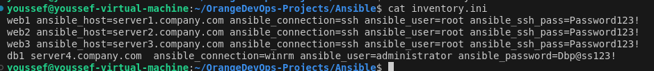
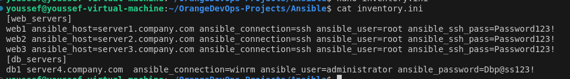

- What inventory parameters can be used to establish a local connection instead of ssh in Ansible?

`ansible_connection=local`

- What value we must set for ansible_connection parameter to connect to a Windows server?

`ansible_connection=winrm`

- We have a sample inventory file called inventory. It has 3 servers listed, add another server called server4.company.com in this file.
```bash
web1 
web2 
web3
```
**First use nano** `nano inventory.ini` then add the server


Then added the aliases named web1, web2 and web3 for the first three hosts respectively. Update this inventory file to add an alias called db1 for server4.company.com host.

```bash
web1 ansible_host=server1.company.com
web2 ansible_host=server2.company.com
```

- As per the details given in the table below, you can see that, the web servers are linux based hosts and the db server is a Windows machine.

	Update the inventory to add a similar entry for server4.company.com host. Find the required details from the table below.

		---------------------------------------------------------------------------
		|  Alias |        HOST         | Connection | User          | Password     | 
		---------------------------------------------------------------------------
		|  web1  | server1.company.com |    ssh     | root          | Password123! |
		---------------------------------------------------------------------------
		|  web2  | server2.company.com |    ssh     | root          | Password123! |
		---------------------------------------------------------------------------
		|  web3  | server3.company.com |    ssh     | root          | Password123! |
		---------------------------------------------------------------------------
		|  db1   | server4.company.com |    winrm   | administrator | Dbp@ss123!   |
		---------------------------------------------------------------------------




- We have inventory file and added a group called web_servers for web servers. Similarly, add a group called db_servers for database servers.

	```bash
	# Sample Inventory File

	# Web Servers
	web1 ansible_host=server1.company.com ansible_connection=ssh ansible_user=root ansible_ssh_pass=Password123!
	web2 ansible_host=server2.company.com ansible_connection=ssh ansible_user=root ansible_ssh_pass=Password123!
	web3 ansible_host=server3.company.com ansible_connection=ssh ansible_user=root ansible_ssh_pass=Password123!

	# Database Servers
	db1 ansible_host=server4.company.com ansible_connection=winrm ansible_user=administrator ansible_password=Password123!


	[web_servers]
	web1
	web2
	web3
	```


- Let us now create a group of groups. Create a new group called all_servers and add the previously created groups web_servers and db_servers under it.
	hint: search for parent group and children
		```bash
		# Sample Inventory File

		# Web Servers
		web1 ansible_host=server1.company.com ansible_connection=ssh ansible_user=root ansible_ssh_pass=Password123!
		web2 ansible_host=server2.company.com ansible_connection=ssh ansible_user=root ansible_ssh_pass=Password123!
		web3 ansible_host=server3.company.com ansible_connection=ssh ansible_user=root ansible_ssh_pass=Password123!

		# Database Servers
		db1 ansible_host=server4.company.com ansible_connection=winrm ansible_user=administrator ansible_password=Password123!


		[web_servers]
		web1
		web2
		web3

		[db_servers]
		db1
		```



- Update the inventory file to represent the data given in the below table in Ansible Inventory format.


		-------------------------------------------------------------------
		| Server Alias |  Server Name  |  OS    |     User      | Password |
		-------------------------------------------------------------------
		| sql_db1      | sql01.xyz.com | Linux  |     root      | Lin$Pass |
		-------------------------------------------------------------------
		| sql_db2      | sql02.xyz.com | Linux  |     root      | Lin$Pass |
		-------------------------------------------------------------------
		| web_node1    | web01.xyz.com | Win    | administrator | Win$Pass |
		-------------------------------------------------------------------
		| web_node2    | web02.xyz.com | Win    | administrator | Win$Pass |
		-------------------------------------------------------------------
		| web_node3    | web03.xyz.com | Win    | administrator | Win$Pass |
		-------------------------------------------------------------------

	 Group the servers together based on this table

		--------------------------------------------------------
		|    Group         |  Members                          |
		--------------------------------------------------------
		|    db_nodes      |  sql_db1, sql_db2                 |
		--------------------------------------------------------
		|   web_nodes      |  web_node1, web_node2, web_node3  |
		--------------------------------------------------------
		|    boston_nodes  |  sql_db1, web_node1               |
		--------------------------------------------------------
		|    dallas_nodes  |  sql_db2, web_node2, web_node3    |
		--------------------------------------------------------
		|   us_nodes       |  boston_nodes, dallas_nodes       |
		--------------------------------------------------------
