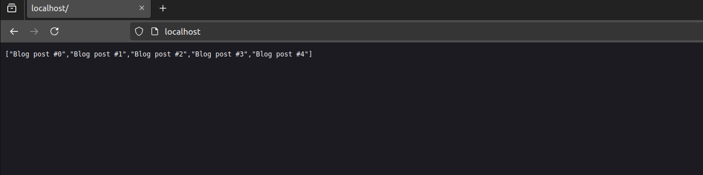

# Docker three tier application

## Objective

We need to build an three tier application (backend,Database,proxy) with docker principles.


	- The backend docker file write in multi-stage approach.
	- The database creadential is in your host machine.
	- Make sure that proxy is up and running in https protocol and the configuration files is in your host machine.
	- Kindly make sure that each container is in seperate network.
	- Make sure that all project is up and down with one command.

## output

**To build the docker-compose file** use `docker-compose build`
```bash
youssef@youssef-virtual-machine:~/Downloads/Docker_Project(1)/Docker_Project$ docker-compose build
WARNING: Python-dotenv could not parse statement starting at line 1
db uses an image, skipping
Building backend
[+] Building 3.1s (15/15) FINISHED                                                                                                                          docker:default
 => [internal] load build definition from Dockerfile                                                                                                                  0.0s
 => => transferring dockerfile: 429B                                                                                                                                  0.0s
 => [internal] load metadata for docker.io/library/debian:bullseye-slim                                                                                               1.1s
 => [internal] load metadata for docker.io/library/golang:1.18                                                                                                        1.1s
 => [internal] load .dockerignore                                                                                                                                     0.0s
 => => transferring context: 2B                                                                                                                                       0.0s
 => [builder 1/6] FROM docker.io/library/golang:1.18@sha256:50c889275d26f816b5314fc99f55425fa76b18fcaf16af255f5d57f09e1f48da                                          0.0s
 => [internal] load build context                                                                                                                                     0.0s
 => => transferring context: 111B                                                                                                                                     0.0s
 => [stage-1 1/3] FROM docker.io/library/debian:bullseye-slim@sha256:00558f781b91e90469812bad32002f311ab26ef241b4a1996f6600680ec82f5c                                 0.0s
 => CACHED [builder 2/6] WORKDIR /app                                                                                                                                 0.0s
 => CACHED [builder 3/6] COPY go.mod go.sum ./                                                                                                                        0.0s
 => CACHED [builder 4/6] RUN go mod download                                                                                                                          0.0s
 => [builder 5/6] COPY . .                                                                                                                                            0.0s
 => [builder 6/6] RUN go build -o main .                                                                                                                              1.8s
 => CACHED [stage-1 2/3] WORKDIR /app                                                                                                                                 0.0s
 => CACHED [stage-1 3/3] COPY --from=builder /app/main .                                                                                                              0.0s
 => exporting to image                                                                                                                                                0.0s
 => => exporting layers                                                                                                                                               0.0s
 => => writing image sha256:4e58fff84a3bb71bc63f857895fd9fbcef9c92bb00ac1e396c4402eb551f4bfe                                                                          0.0s
 => => naming to docker.io/library/project_backend                                                                                                                    0.0s
Building proxy
[+] Building 1.0s (8/8) FINISHED                                                                                                                            docker:default
 => [internal] load build definition from Dockerfile                                                                                                                  0.0s
 => => transferring dockerfile: 120B                                                                                                                                  0.0s
 => [internal] load metadata for docker.io/library/nginx:alpine                                                                                                       1.0s
 => [internal] load .dockerignore                                                                                                                                     0.0s
 => => transferring context: 2B                                                                                                                                       0.0s
 => [1/3] FROM docker.io/library/nginx:alpine@sha256:a5127daff3d6f4606be3100a252419bfa84fd6ee5cd74d0feaca1a5068f97dcf                                                 0.0s
 => [internal] load build context                                                                                                                                     0.0s
 => => transferring context: 123B                                                                                                                                     0.0s
 => CACHED [2/3] COPY nginx.conf /etc/nginx/nginx.conf                                                                                                                0.0s
 => CACHED [3/3] COPY ssl/ /etc/nginx/ssl/                                                                                                                            0.0s
 => exporting to image                                                                                                                                                0.0s
 => => exporting layers                                                                                                                                               0.0s
 => => writing image sha256:cf4db022707307e1dff385faaa38ea4086b9956a0db01d15d88b44ca43c24ed5                                                                          0.0s
 => => naming to docker.io/library/project_proxy
```
## then use `docker-compose up`

```bash
youssef@youssef-virtual-machine:~/Downloads/Docker_Project(1)/Docker_Project$ docker-compose up
WARNING: Python-dotenv could not parse statement starting at line 1
Starting docker_project_db_1 ... done
Starting docker_project_backend_1 ... done
Starting docker_project_proxy_1   ... done
Attaching to docker_project_db_1, docker_project_backend_1, docker_project_proxy_1
backend_1  | 2024/09/13 19:05:50 Prepare db...
db_1       | 2024-09-13 19:05:49+00:00 [Note] [Entrypoint]: Entrypoint script for MySQL Server 8.0.39-1.el9 started.
db_1       | 2024-09-13 19:05:50+00:00 [Note] [Entrypoint]: Switching to dedicated user 'mysql'
db_1       | 2024-09-13 19:05:50+00:00 [Note] [Entrypoint]: Entrypoint script for MySQL Server 8.0.39-1.el9 started.
db_1       | '/var/lib/mysql/mysql.sock' -> '/var/run/mysqld/mysqld.sock'
db_1       | 2024-09-13T19:05:50.830730Z 0 [Warning] [MY-011068] [Server] The syntax '--skip-host-cache' is deprecated and will be removed in a future release. Please use SET GLOBAL host_cache_size=0 instead.
db_1       | 2024-09-13T19:05:50.832808Z 0 [System] [MY-010116] [Server] /usr/sbin/mysqld (mysqld 8.0.39) starting as process 1
db_1       | 2024-09-13T19:05:50.844102Z 1 [System] [MY-013576] [InnoDB] InnoDB initialization has started.
db_1       | 2024-09-13T19:05:51.284479Z 1 [System] [MY-013577] [InnoDB] InnoDB initialization has ended.
proxy_1    | /docker-entrypoint.sh: /docker-entrypoint.d/ is not empty, will attempt to perform configuration
proxy_1    | /docker-entrypoint.sh: Looking for shell scripts in /docker-entrypoint.d/
proxy_1    | /docker-entrypoint.sh: Launching /docker-entrypoint.d/10-listen-on-ipv6-by-default.sh
proxy_1    | 10-listen-on-ipv6-by-default.sh: info: IPv6 listen already enabled
proxy_1    | /docker-entrypoint.sh: Sourcing /docker-entrypoint.d/15-local-resolvers.envsh
proxy_1    | /docker-entrypoint.sh: Launching /docker-entrypoint.d/20-envsubst-on-templates.sh
db_1       | 2024-09-13T19:05:51.574596Z 0 [Warning] [MY-010068] [Server] CA certificate ca.pem is self signed.
db_1       | 2024-09-13T19:05:51.575858Z 0 [System] [MY-013602] [Server] Channel mysql_main configured to support TLS. Encrypted connections are now supported for this channel.
proxy_1    | /docker-entrypoint.sh: Launching /docker-entrypoint.d/30-tune-worker-processes.sh
proxy_1    | /docker-entrypoint.sh: Configuration complete; ready for start up
db_1       | 2024-09-13T19:05:51.586468Z 0 [Warning] [MY-011810] [Server] Insecure configuration for --pid-file: Location '/var/run/mysqld' in the path is accessible to all OS users. Consider choosing a different directory.
db_1       | 2024-09-13T19:05:51.641693Z 0 [System] [MY-011323] [Server] X Plugin ready for connections. Bind-address: '::' port: 33060, socket: /var/run/mysqld/mysqlx.sock
db_1       | 2024-09-13T19:05:51.642087Z 0 [System] [MY-010931] [Server] /usr/sbin/mysqld: ready for connections. Version: '8.0.39'  socket: '/var/run/mysqld/mysqld.sock'  port: 3306  MySQL Community Server - GPL.
backend_1  | 2024/09/13 19:05:52 Listening on port 8000


```
## Then Go to the browser and type **localhost**

```bash
proxy_1    | 172.25.0.1 - - [13/Sep/2024:19:06:28 +0000] "GET / HTTP/1.1" 200 77 "-" "Mozilla/5.0 (X11; Ubuntu; Linux x86_64; rv:129.0) Gecko/20100101 Firefox/129.0"
backend_1  | 172.25.0.4 - - [13/Sep/2024:19:06:28 +0000] "GET / HTTP/1.0" 200 77
```

