- What is the packages is a prerequisite for installing Jenkins ?
	1- Java Development Kit (JDK) (OpenJDK 8 or later)
	2- wget or curl (optional)
	3- git (optional)

- Run this command and tell me the ssh port: curl -Lv http://localhost:8085/login 2>&1 | grep -i 'x-ssh-endpoint'

**No Output shown**
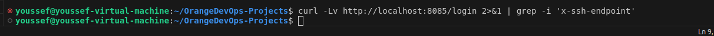

- What are jenkins plugins?

	A. Plugins are used to configure the security settings in Jenkins.
	B. Plugins are the primary means of enhancing the functionality of a Jenkins environment to suit organization or user specific needs.
	C. Plugins are used to create jobs in Jenkins.
	D. Plugins are the tools to setup CI/CD pipelines in Jenkins.

`B`

- Can we install the .hpi plugin file from Jenkins web UI?
**Yes**
- Make sure that Git and Github plugins are installed if it's not kindly install them

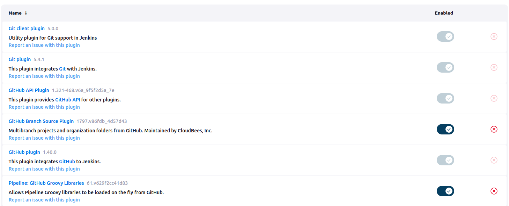

- Install Jenkins as normal service or as docker container (bouns install it using ansible)
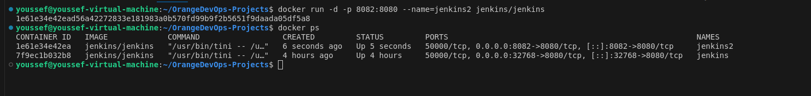

- Under what location Jenkins store its data primarily?

`$JENKINS_HOME folder`

- Install and configure thinbackup plugin and make sure that the default dir for backup is: /var/lib/jenkins/jenkins_backup

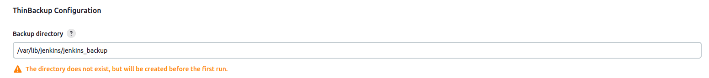

- Create a Jenkins user as per the details provided below.

	A. Username: jenkins
	B. Password: jenk!n$
	C. Full Name: Orange DevOps

	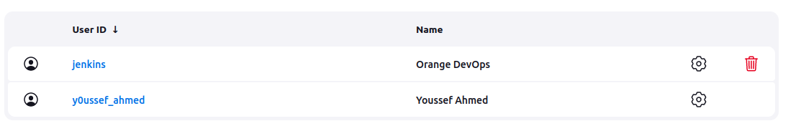

- Install the Role-based Authorization Strategy plugin and enable the Role-Based Strategy authorization in Jenkins security settings.

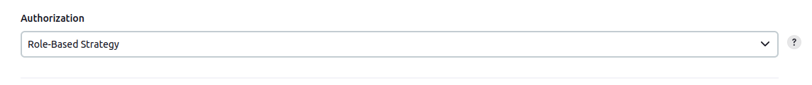

- Create a role named developers and make sure it has overall Read permissions alone. Also assign role called developers to the user called jenkins.
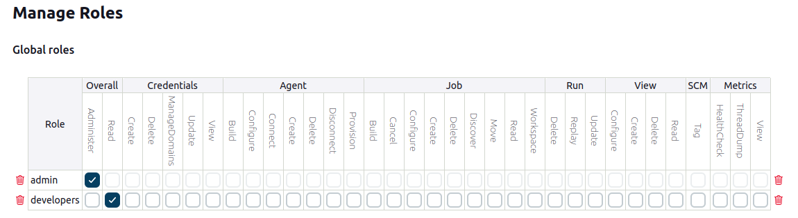

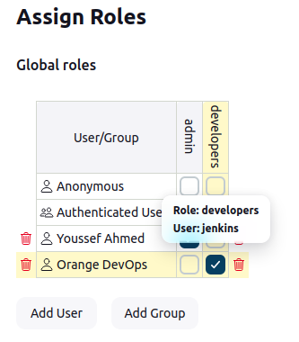

- First, install the Matrix Authorization Strategy plugin and using the Project-based Matrix Authorization Strategy assign some permissions that would allow jenkins to build the mytest job.

	Once this is done, build this job through user jenkins.
	Note: You should use jenkins's credentials from the previous question.
	
		Username: jenkins
		Password: jenk!n$

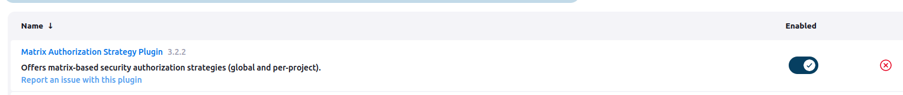
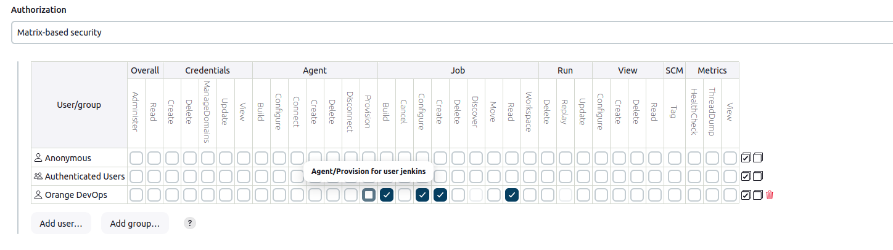

- Install Pipeline Jenkins plugin?
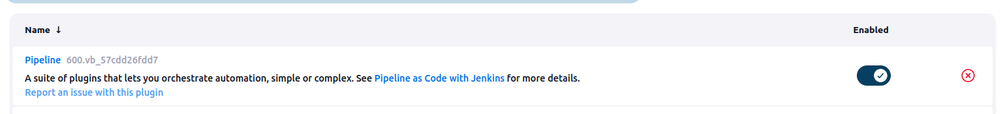

- Create a pipeline job named hello-world, it should just echo the Hello World string.

- Install SSH Build Agents Jenkins plugin.

- Create a simple Jenkins job that prints "Hello, World!" in the console output.
	Set up a basic Freestyle job with a shell command to print a message.

- Configure a Jenkins job to pull code from a public GitHub repository.
	Use the Git plugin to connect to the repository and check out the latest code.

- Set up a Jenkins job that triggers every 5 minutes using the "Build periodically" option.
	Use the cron syntax to configure the trigger.

- Install a Jenkins plugin from the Plugin Manager.
	Pick any plugin (Docker) and verify that it's successfully installed.

- Configure a Jenkins job to send email notifications when a build fails.
	Set up the Email Extension Plugin and define an email recipient list.

- Create a Jenkins pipeline with two stages:
	Stage 1: Pull code from GitHub(repo from your choise)
	Stage 2: Run a simple shell script that lists all files in the workspace.

- Set up a Jenkins job to archive log files generated by the build.
	Use the "Archive the artifacts" post-build action to store the logs.

- Set up a Jenkins job to clean up old builds (e.g., only keep the last 5 builds).
	Configure the job to discard old builds using the "Discard Old Builds" option.

- Create a Jenkins job that takes user input for a name and prints a greeting message in the console output (e.g., "Hello, [Name]!" ).
	Use the "This build is parameterized" option and add a string parameter.

- Set up a Jenkins job to build a Java project using the javac command.
	Ensure the job compiles a basic Java file and outputs the result.

- Create a Jenkins job that runs a script to check for disk space usage on the Jenkins server.
	Use a simple shell script in the build step to check the disk space (df -h on Linux).

- Create a Jenkins job that executes a Python script from the repository search for a repo or create one.
	Ensure the job pulls the script from GitHub and runs it.

- Configure a Jenkins job that runs on an agent (slave) node with specific labels ("linux").
	Set up a node with a label and configure the job to run only on that node.