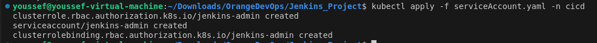
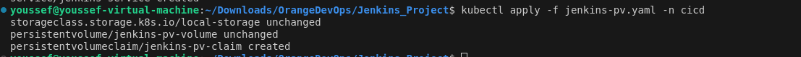
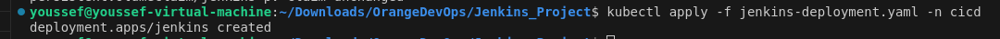
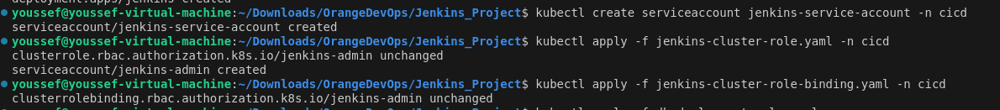
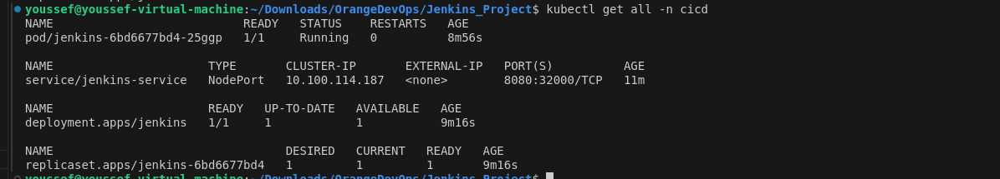
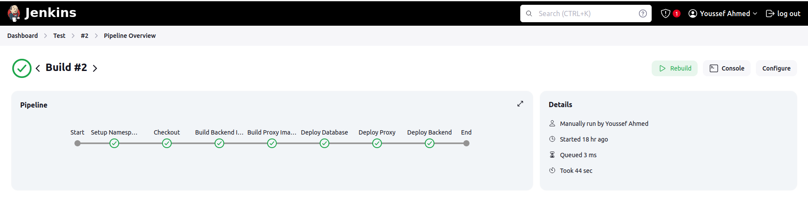

# Project Overview

This project aims to streamline the deployment process by leveraging a Jenkins pipeline for continuous integration and delivery. The initial stage involves cloning a Git repository and setting up a dedicated environment for the Continuous Integration and Continuous Deployment (CI/CD) process.

- This project will initially be implemented within a Jenkins pipeline.
- The first stage involves cloning a Git repository, followed by the creation of a namespace named "cicd."
Within this namespace, a pod called "jenkins" will be deployed, which is responsible for establishing a namespace called "webapp."
- The "webapp" namespace will host a three-tier application architecture, comprising the backend, database, and proxy components, all designed according to Docker principles.

## Starting with building the jenkins image located in the project

`docker build -t jenkins-youssef:latest .`

```bash
[+] Building 87.9s (6/6) FINISHED                                                                                                                              docker:default
 => [internal] load build definition from Dockerfile                                                                                                                     0.0s
 => => transferring dockerfile: 700B                                                                                                                                     0.0s
 => [internal] load metadata for docker.io/jenkins/jenkins:lts                                                                                                           2.6s
 => [internal] load .dockerignore                                                                                                                                        0.0s
 => => transferring context: 2B                                                                                                                                          0.0s
 => [1/2] FROM docker.io/jenkins/jenkins:lts@sha256:429647d4688daa3ca2520fb771a391bae8efa1e4def824b32345f13dde223227                                                    67.2s
 => => resolve docker.io/jenkins/jenkins:lts@sha256:429647d4688daa3ca2520fb771a391bae8efa1e4def824b32345f13dde223227                                                     0.0s
 => => sha256:cdd62bf39133c498a16f7a7b1b6555ba43d02b2511c508fa4c0a9b1975ffe20e 49.56MB / 49.56MB                                                                        19.5s
 => => sha256:a346a6aee58352af414d05dec9d4c0d3ccbe792e0a4cbf002669d5497ce7a015 2.58kB / 2.58kB                                                                           0.0s
 => => sha256:bac101b69b63e688308ee8071d9e3b73c9f096b22399cd7277ae6f312add4acf 12.63kB / 12.63kB                                                                         0.0s
 => => sha256:21f106ffc42180ecc5403810739fad8d57de6c6d717e178eaa1df84f547f3c32 61.60MB / 61.60MB                                                                        54.4s
 => => sha256:39df2c5808cf58f059e82236d7d387368c1d68ed27710225aaf47971cfa2dee8 8.85MB / 8.85MB                                                                           8.0s
 => => sha256:429647d4688daa3ca2520fb771a391bae8efa1e4def824b32345f13dde223227 3.12kB / 3.12kB                                                                           0.0s
 => => sha256:d9d5ad5daae2a3cb84fd8e90690905a16be7f16eb847f07cdc1a578565d1ca06 1.23kB / 1.23kB                                                                           8.7s
 => => sha256:21d9152ebad07620f4a21e1403eb7149b15ae6e8efac300fbe61f72ce9b6b563 183B / 183B                                                                               9.1s
 => => sha256:ddc06df7461540c46de22e13bdac30688391ff15a7afb0d0bf1a581eccd73032 93.14MB / 93.14MB                                                                        65.8s
 => => sha256:bf388b3d48680cd6d9e7bddfc87fbddc1b83eb22917ebc1828d7babaf9131a37 190B / 190B                                                                              20.2s
 => => extracting sha256:cdd62bf39133c498a16f7a7b1b6555ba43d02b2511c508fa4c0a9b1975ffe20e                                                                                2.0s
 => => sha256:1f6fc1ff002b4283313eed02b9a18e1c9a65ee83cc36a7a6171a94b91c1d5b4c 6.24MB / 6.24MB                                                                          23.3s
 => => sha256:276b7c1ccf389cff0ad90b259122e77a490680276117e2bab55eedafe0418b7c 63.24MB / 63.24MB                                                                        50.3s
 => => sha256:d9ab3d4a2c85cd932277175d50adfbd54d08489b765022109d08ba998ed52991 1.92kB / 1.92kB                                                                          50.9s
 => => sha256:ac000fcb71ded8dde1d7926a4aa545dc0460acbb410ee8ab9d1fe6d46135e634 1.24kB / 1.24kB                                                                          51.3s
 => => sha256:79eacf1576c1a0e0e3728cc51986e36cf82d45cf0fd1c8af24bb1ba39c8d6bc8 391B / 391B                                                                              51.6s
 => => extracting sha256:21f106ffc42180ecc5403810739fad8d57de6c6d717e178eaa1df84f547f3c32                                                                                1.8s
 => => extracting sha256:39df2c5808cf58f059e82236d7d387368c1d68ed27710225aaf47971cfa2dee8                                                                                0.1s
 => => extracting sha256:d9d5ad5daae2a3cb84fd8e90690905a16be7f16eb847f07cdc1a578565d1ca06                                                                                0.0s
 => => extracting sha256:21d9152ebad07620f4a21e1403eb7149b15ae6e8efac300fbe61f72ce9b6b563                                                                                0.0s
 => => extracting sha256:ddc06df7461540c46de22e13bdac30688391ff15a7afb0d0bf1a581eccd73032                                                                                0.5s
 => => extracting sha256:bf388b3d48680cd6d9e7bddfc87fbddc1b83eb22917ebc1828d7babaf9131a37                                                                                0.0s
 => => extracting sha256:1f6fc1ff002b4283313eed02b9a18e1c9a65ee83cc36a7a6171a94b91c1d5b4c                                                                                0.1s
 => => extracting sha256:276b7c1ccf389cff0ad90b259122e77a490680276117e2bab55eedafe0418b7c                                                                                0.7s
 => => extracting sha256:d9ab3d4a2c85cd932277175d50adfbd54d08489b765022109d08ba998ed52991                                                                                0.0s
 => => extracting sha256:ac000fcb71ded8dde1d7926a4aa545dc0460acbb410ee8ab9d1fe6d46135e634                                                                                0.0s
 => => extracting sha256:79eacf1576c1a0e0e3728cc51986e36cf82d45cf0fd1c8af24bb1ba39c8d6bc8                                                                                0.0s
 => [2/2] RUN apt-get update &&     apt-get install -y curl &&     curl -LO "https://dl.k8s.io/release/v1.26.0/bin/linux/amd64/kubectl" &&     chmod +x kubectl &&      17.9s
 => exporting to image                                                                                                                                                   0.1s
 => => exporting layers                                                                                                                                                  0.1s
 => => writing image sha256:014708f322ec1bbe060f42419197f7ecc4f79f1dc8806a4c9df11c5b3e24dec2                                                                             0.0s
 => => naming to docker.io/library/jenkins-youssef:latest

```
Make sure the image created sucessfully

`docker images`
```bash
REPOSITORY                    TAG       IMAGE ID       CREATED          SIZE
jenkins-youssef               latest    014708f322ec   10 seconds ago   518MB
gcr.io/k8s-minikube/kicbase   v0.0.45   aeed0e1d4642   4 weeks ago      1.28GB
```
Create `cicd` namespace using `kubectl create namespace cicd`


Create Service Account in the same namespace



Create Storage class Pv and Pvc



Create Jenkins Deployment



Creating Jenkins Service account , Cluster role , Cluster role binding




Make sure that jenkins pod is running 




open jenkins and create job **Pipline**

```bash
pipeline {
    agent any
    environment {
        NAMESPACE = 'webapp'
        REPO_URL = 'https://github.com/youssefahmed8/OrangeDevOps.git'
    }
    stages {
        stage('Setup Namespace') {
            steps {
                script {
                    // Create the webapp namespace if it doesn't exist
                    sh "kubectl apply -f Kubernetes_Projectnamespace.yaml || echo 'Namespace ${NAMESPACE} already exists.'"
                }
            }
        }
        stage('Checkout') {
            steps {
                // Checkout the repository from the specified URL
                git branch: 'main', url: "${REPO_URL}"
            }
        }
        stage('Setup Docker Environment') {
            steps {
                script {
                    // Set up Minikube Docker environment
                    sh "eval \$(minikube docker-env)"
                }
            }
        }
        stage('Build Backend Image') {
            steps {
                script {
                    // Build the backend Docker image with no cache
                    sh """
                    docker build --no-cache -t project_backend:latest -f Docker_Project/backend/Dockerfile Docker_Project/backend
                    """
                }
            }
        }
        stage('Build Proxy Image') {
            steps {
                script {
                    // Build the proxy Docker image with no cache
                    sh """
                    docker build --no-cache -t project_proxy:latest -f Docker_Project/proxy/Dockerfile Docker_Project/proxy
                    """
                }
            }
        }
        stage('Deploy Backend') {
            steps {
                script {
                    // Apply the backend deployment and service
                    sh '''
                    kubectl apply -f Kubernetes_Project/backend-deployment.yaml -n ${NAMESPACE}
                    kubectl apply -f Kubernetes_Project/backend-service.yaml -n ${NAMESPACE}
                    '''
                }
            }
        }        
        stage('Deploy Database') {
            steps {
                script {
                    // Apply the database YAML files from Kubernetes_Project
                    sh '''
                    kubectl apply -f Kubernetes_Project/db-deployment.yaml -n ${NAMESPACE}
                    kubectl apply -f Kubernetes_Project/db-pv-pvc.yaml -n ${NAMESPACE}
                    kubectl apply -f Kubernetes_Project/db-secret.yaml -n ${NAMESPACE}
                    kubectl apply -f Kubernetes_Project/db-service.yaml -n ${NAMESPACE}
                    '''
                }
            }
        }
        stage('Deploy Proxy') {
            steps {
                script {
                    // Apply the proxy deployment and service
                    sh '''
                    kubectl apply -f Kubernetes_Project/proxy-deployment.yaml -n ${NAMESPACE}
                    kubectl apply -f Kubernetes_Project/proxy-service.yaml -n ${NAMESPACE}
                    '''
                }
            }
        }

    }
}
```

Jenkins Pipline overview



