# Kubernetes_lab


## 1- How many pods exist on the system?

## 2- How many Nodes exist on the system?
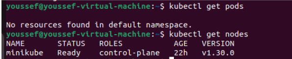

------------------------

## 3- Create a new pod with the nginx image.

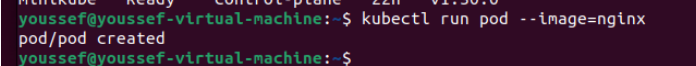

------------------------

## 4- Which nodes are these pods placed on?

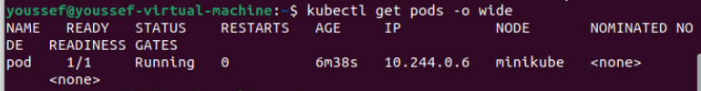

------------------------

## 5- Create pod from the below yaml using kubectl apply command

```yaml
apiVersion: v1
kind: Pod
metadata:
  name: webapp
  namespace: default
spec:
  containers:
  - image: nginx
    imagePullPolicy: Always
    name: nginx
  - image: agentx
    imagePullPolicy: Always
    name: agentx
```

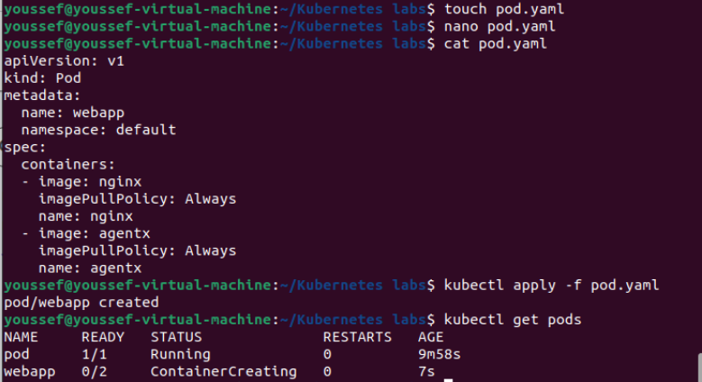

------------------------
## 6- How many containers are part of the pod webapp 

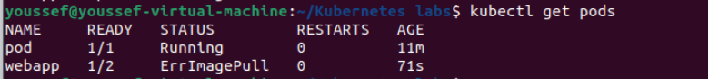

------------------------


## 7- What images are used in the new webapp pod?

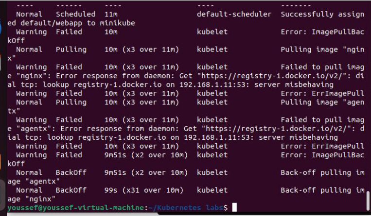

------------------------

## 8- What is the state of the container agentx in the pod webapp
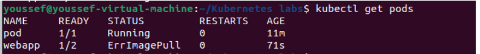

------------------------

## 9- Why do you think the container agentx in pod webapp is in error?

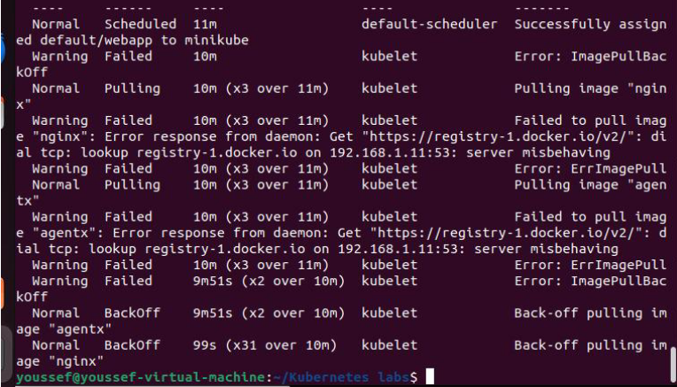

------------------------
## 10- Delete the webapp Pod.

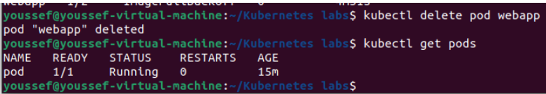

------------------------

## 11- Create a new pod with the name redis and with the image redis123.
•	Name: redis
•	Image Name: redis123
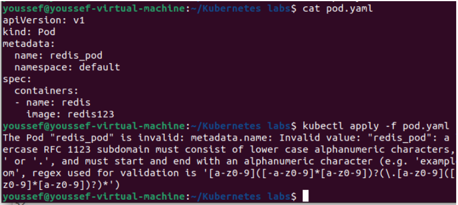

------------------------

## 12- Now change the image on this pod to redis.
Once done, the pod should be in a running state.
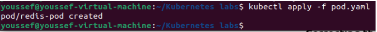

------------------------

## 13- Create a pod called my-pod of image nginx:alpine

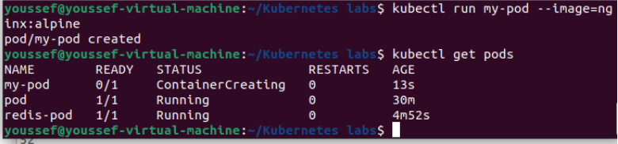

------------------------

## 14- Delete the pod called my-pod

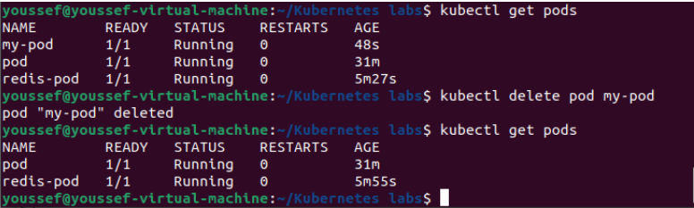