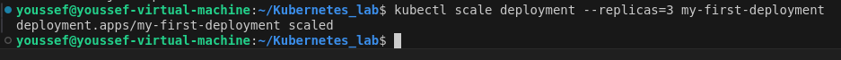
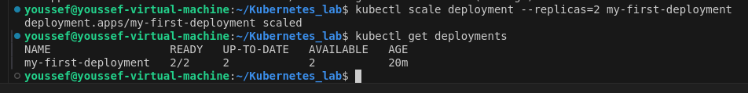
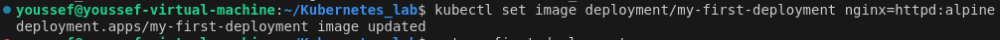
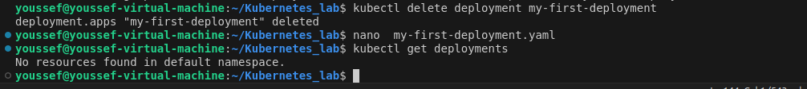
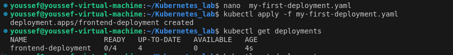
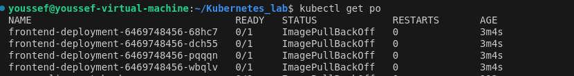
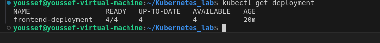
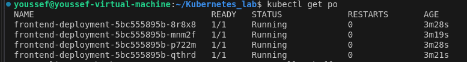
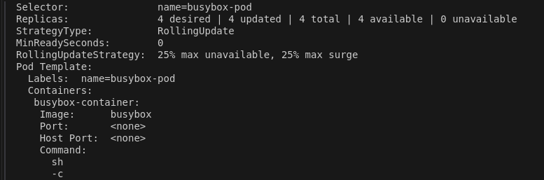

# Kubernetes_lab3

# Deployment

## 1- Create a deployment called my-first-deployment of image nginx:alpine in the default namespace.
### Check to make sure the deployment is healthy.
```yaml
apiVersion: apps/v1
kind: Deployment
metadata:
  name: my-first-deployment
spec:
  replicas: 1
  selector:
    matchLabels:
      app: my-first-deployment
  template:
    metadata:
      labels:
        app: my-first-deployment
    spec:
      containers:
      - name: nginx
        image: nginx:alpine
        ports:
        - containerPort: 80
```


----------------
## 2- Scale my-first-deployment up to run 3 replicas.

### Check to make sure all 3 replicas are ready.
`kubectl get deployments`

### Another Detailed 
`kubectl describe deployment my-first-deployment`

----------------
## 3- Scale my-first-deployment down to run 2 replicas.
`kubectl scale deployment --replicas=2 my-first-deployment`

---------------
## 4- Change the image my-first-deployment runs from nginx:alpine to httpd:alpine .
`kubectl set image deployment/my-first-deployment nginx=httpd:alpine`

--------------------------
## 5- Delete the deployment my-first-deployment
`kubectl delete deployment my-first-deployment`

----------------------------
## 6- Create deployment from the below yaml


```yaml
apiVersion: apps/v1
kind: Deployment
metadata:
  name: frontend-deployment
  namespace: default
spec:
  replicas: 4
  selector:
    matchLabels:
      name: busybox-pod
  strategy:
    rollingUpdate:
      maxSurge: 25%
      maxUnavailable: 25%
    type: RollingUpdate
  template:
    metadata:
      labels:
        name: busybox-pod
    spec:
      containers:
      - command:
        - sh
        - -c
        - echo Hello Kubernetes! && sleep 3600
        image: busybox888
        imagePullPolicy: Always
        name: busybox-container
```        

### We need to address the issue so we have to show pods `kubectl get pods` and this is the output

### Then use `kubectl describe po frontend-deployment-6469748456-68hc7`to show the description of the pod and what can cause error and this is the output

### edit the image name 

-------------
## 7- How many ReplicaSets exist on the system now?
`kubectl get rs`

------------------------------
## 8- How many PODs exist on the system now?
` kubectl get po`

-----------------
## 9- Out of all the existing PODs, how many are ready?

### Based on the last output the 4 PODS are running


-------------------
## 10- What is the image used to create the pods in the new deployment?
`kubectl describe deployment frontend-deployment`

---------------------
## 11- Why do you think the deployment is not ready?

### The Reason is there is not image with that name (busybox888)

---------------------
