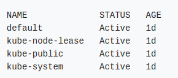

# Kubernetes_lab4

# Namespace
## What is a namespace in Kubernetes, and why is it used?

### What is a Namespace?

#### Namespaces are a way to organize clusters into virtual sub-clusters — they can be helpful when different teams or projects share a Kubernetes cluster. Any number of namespaces are supported within a cluster, each logically separated from others but with the ability to communicate with each other. Namespaces cannot be nested within each other.

### why is it used?


#### > Allowing teams or projects to exist in their own virtual clusters without fear of impacting each other’s work.

#### > Enhancing role-based access controls (RBAC) by limiting users and processes to certain namespaces.

#### > Enabling the dividing of a cluster’s resources between multiple teams and users via resource quotas.

#### > Providing an easy method of separating development, testing, and deployment of containerized applications enabling the entire lifecycle to take place on the same cluster.

---------------------
## How do you create a new namespace in Kubernetes using the kubectl command?

#### To view the namespaces in Kubernetes, you can use the command `kubectl get ns` or `kubectl get namespace`. This will provide a list of all the existing namespaces. To create a new namespace, you can use the command `kubectl create namespace dev` or `Kubectl get ns dev`. To verify the creation of the namespace, use kubectl get ns.

#### Resource quotas and policies can be applied to the namespace, ensuring that it does not overuse the cluster resources. This feature is particularly useful when managing multiple teams like the development team, testing team, or other groups. Each team can work within a specific namespace with defined resource quotas and policies.

---------------------
## How can you list all namespaces in a Kubernetes cluster?

#### To list all namespaces in a Kubernetes cluster, you can use the `kubectl get namespaces` command. This command retrieves and displays information about all namespaces in the cluster.


---------------------
## What is the default namespace in Kubernetes? What happens if you do not specify a namespace when deploying a resource?

#### In most Kubernetes distributions, the cluster comes with a few default namespaces. Specifically, there are three primary namespaces that Kubernetes ships with:

- **default**: The default namespace where user applications and services are usually created.
- **kube-system**: Used for Kubernetes system components and internal resources. It is best to leave this namespace alone, especially in managed systems like [Google Kubernetes Engine](https://cloud.google.com/kubernetes-engine/).
- **kube-public**: Intended for resources meant to be accessible to all users (including unauthenticated users), but it is not widely used in practice.

In most cases, you will primarily interact with the `default` namespace for deploying and managing your applications.

---------------------
## How do you delete a namespace in Kubernetes? What happens to the resources within it?

#### To delete a namespace use the command `kubectl delete -f namespace.yaml`

### What Happens to the Resources?

When you delete a namespace, Kubernetes will also delete all the resources contained within that namespace. This includes:

- **Pods**: All pods running in the namespace will be terminated.
- **Services**: Any services defined in the namespace will be removed.
- **Deployments, ReplicaSets, and StatefulSets**: These resources will be deleted along with their associated pods.
- **ConfigMaps and Secrets**: All configuration data and secrets specific to the namespace will be deleted.
- **Persistent Volume Claims (PVCs)**: PVCs associated with the namespace will be deleted, but whether the associated Persistent Volumes (PVs) are deleted depends on their ReclaimPolicy (e.g., `Delete` or `Retain`).


---------------------
## How can you switch between namespaces while using the kubectl command?

#### To switch to a specific namespace, we can use the kubectl config set-context command: `kubectl config set-context --current --namespace=<namespace-name>`
#### We replace namespace-name with the name of the desired namespace we want to switch to. For instance, let’s switch to the namespace “kube-public” using the kubectl command: `kubectl config set-context --current --namespace=kube-public`

---------------------
## How do you create a Kubernetes deployment in a specific namespace?

### To Create the development namespace using kubectl there is two ways

#### 1.Create a Deployment Using a YAML Manifest`deployment.yaml`

```yaml
apiVersion: apps/v1
kind: Deployment
metadata:
  name: my-deployment
  namespace: my-namespace # Specify the namespace here
spec:
  replicas: 3
  selector:
    matchLabels:
      app: my-app
  template:
    metadata:
      labels:
        app: my-app
    spec:
      containers:
      - name: my-container
        image: nginx:alpine
        ports:
        - containerPort: 80

```
#### 2.Create a Deployment Using kubectl Command

`kubectl create deployment my-deployment --image=nginx:alpine --namespace=my-namespace`

---------------------

## Can two different namespaces have resources with the same name? Explain your answer.

### Yes, two different namespaces in Kubernetes can have resources with the same name.

### How Namespaces Provide Isolation

Namespaces create logical partitions within the same Kubernetes cluster. This means that:

- **Unique Names Within a Namespace**: Each resource must have a unique name within a given namespace. For example, if you have a pod named `my-app` in the `development` namespace, you cannot have another pod named `my-app` in the same `development` namespace.

- **No Conflict Between Namespaces**: Different namespaces are isolated from each other. This allows you to have multiple resources with the same name as long as they reside in different namespaces. For instance:
  - You can have a pod named `my-app` in the `development` namespace.
  - You can also have a pod named `my-app` in the `production` namespace.
---------------------
## How can you check the resource quotas and limits for a specific namespace?

#### 1.Check Resource Quotas

`kubectl get resourcequota -n my-namespace`

#### 2.Check Resource Limits

`kubectl get pods -n <namespace-name> -o jsonpath='{range .items[*]}{.metadata.name}{"\n"}{range .spec.containers[*]}{.name}{": "}{.resources.requests.cpu}{" CPU, "}{.resources.requests.memory}{" Memory, "}{.resources.limits.cpu}{" CPU, "}{.resources.limits.memory}{" Memory"}{"\n"}{end}{end}'`

---------------------

## How do you configure a kubectl context to always use a specific namespace by default?

### Steps to Configure the Default Namespace

#### 1. Identify the Current Context

`kubectl config current-context`

#### 2. Set the Default Namespace for the Current Context
`kubectl config set-context --current --namespace=my-namespace`

#### 3.Verify the Configuration

`kubectl config view --minify`

---------------------
## Create a YAML file to define a new namespace called dev-environment. Deploy it using kubectl.

#### 1.Create the YAML File for the Namespace the file named `namespace-dev-environment.yaml`

```yaml
apiVersion: v1
kind: Namespace
metadata:
  name: dev-environment
```
#### 2. Deploy the Namespace Using kubectl

`kubectl apply -f namespace-dev-environment.yaml`


---------------------
## Write a command to deploy a pod named test-pod running the nginx image into a namespace called testing.

#### To deploy a pod named `test-pod` running the `nginx` image into a namespace called `testing`, you can use the `kubectl run` command with the `--namespace` flag to specify the namespace. Here's the command:
`kubectl run test-pod --image=nginx --namespace=testing`

---------------------
## List all the pods running in a namespace called production.

#### To list all the pods running in a namespace called `production`, you can use the `kubectl get pods` command with the `--namespace` (or `-n`) flag. Here’s the command:

`kubectl get pods -n production`

---------------------
## Resourses
[VMware](https://www.vmware.com/topics/kubernetes-namespace)
[Civo Academy](https://www.civo.com/academy/kubernetes-concepts/kubernetes-namespaces)
[Kubernetes](https://kubernetes.io/docs/concepts/overview/working-with-objects/namespaces/)
[Learning-ocean](https://learning-ocean.com/tutorials/kubernetes/kubernetes-delete-resources/)
