# Kubernetes_Day2_lab5

## 1- What is a Service in Kubernetes, and why is it needed?

### A Kubernetes service is a logical abstraction for a deployed group of pods in a cluster (which all perform the same function). 
### Since pods are ephemeral, a service enables a group of pods, which provide specific functions (web services, image processing, etc.) to be assigned a name and unique IP address (clusterIP). As long as the service is running that IP address, it will not change. Services also define policies for their access.

## Why is ti needed ?
### - Stable Network Endpoint: Pods in Kubernetes can come and go, and their IP addresses can change. A Service provides a stable IP address and DNS name that clients can use to connect to the Pods, even if the Pods themselves are replaced or scaled.

### - Load Balancing: A Service can automatically distribute traffic among the Pods it targets, ensuring that requests are evenly distributed. This built-in load balancing helps with scaling and availability.

### - Service Discovery: Services in Kubernetes can be accessed by name through DNS. Kubernetes automatically creates a DNS entry for each Service, allowing Pods to find and connect to other services using their names instead of IP addresses.

### - Decoupling: Services decouple the communication between clients and Pods. This separation allows you to change the underlying Pods (e.g., upgrading the application) without affecting how clients access the servic

## 2- What are the different types of Services in Kubernetes (e.g., ClusterIP, NodePort) and what are their use cases?

### ClusterIP
- **Description**: Exposes the Service on an internal IP address within the cluster.
- **Accessibility**: Only reachable from within the cluster.
- **Example:** If you have a database service and a web application service, the web application service might use a ClusterIP Service to connect to the database, ensuring that only the web application and other internal components can reach the database.

### NodePort
- **Description**: Exposes the Service on each Node's IP at a static port (NodePort).
- **Accessibility**: Can be accessed from outside the cluster via `<NodeIP>:<NodePort>`.
- **Example:** If you are running a web application that needs to be accessed from outside your Kubernetes cluster, you can use a NodePort Service to expose it. External users can then access the web application through the IP address of any node and the designated port.

## 3- what are LoadBalancer, ExternalName service in kuberenetes and what are their use cases?
**Load Balancer:** For clusters running on public cloud providers like AWS or Azure, creating a load LoadBalancer service provides an equivalent to a clusterIP service, extending it to an external load balancer that is specific to the cloud provider. Kubernetes will automatically create the load balancer, provide firewall rules if needed, and populate the service with the external IP address assigned by the cloud provider.

**ExternalName:** ExternalName services are similar to other Kubernetes services; however, instead of being accessed via a clusterIP address, it returns a CNAME record with a value that is defined in the externalName: parameter when creating the service.

## 4- How does a Kubernetes Service use selectors to identify the Pods it routes traffic to? Can a Service be created without a selector?

### By matching labels specified in the service definition with the labels assigned to pods

### Yes, a Service in Kubernetes can be created without a selector, but it won't be able to automatically discover and route traffic to Pods based on labels.

## 5- Explain how a NodePort service works in Kubernetes. What are its advantages and limitations?

### How a NodePort Service Works
**Service Definition:** A `NodePort` Service is created by setting the `type` field to `NodePort` in the Service definition.
The `NodePort` field specifies the port on each node where the Service will be accessible. If not specified, Kubernetes will automatically allocate a port from a default range (30000-32767).
### Advantages

- **Simplicity**:
  - **Ease of Use**: NodePort services are straightforward to set up. They allow you to expose your application on a port on every node in the cluster without additional configuration.

- **Direct Access**:
  - **Direct Exposure**: Provides a simple way to expose services externally without relying on external load balancers or Ingress controllers.

- **No Cloud Provider Dependency**:
  - **Cloud-Agnostic**: Works on any Kubernetes setup, regardless of the underlying infrastructure (cloud, on-premises, or bare metal), since it does not require a cloud provider's load balancing features.

- **Testing and Development**:
  - **Local Testing**: Useful for testing and development environments where you need to quickly expose services without setting up complex networking solutions.

### Limitations

- **Limited Port Range**:
  - **Port Allocation**: NodePort services use a predefined port range (default is 30000-32767). If you need to expose services on different ports, you are limited by this range unless you change the configuration (not always advisable).

- **Security Concerns**:
  - **Exposure Risks**: Every node exposes the service on the specified NodePort, which can lead to security risks if the service is not properly secured or if it is exposed to the public internet.

- **Scalability Issues**:
  - **Load Distribution**: While NodePort services distribute traffic to Pods, the built-in load balancing may not be as robust as external load balancers, which can handle more complex traffic distribution and health checks.

- **No Integrated Load Balancing**:
  - **Basic Load Balancing**: NodePort uses basic iptables rules for load balancing across nodes, which may not be as sophisticated or as efficient as cloud-based load balancers.

## 6- What is a Headless Service in Kubernetes, and when would you use it? How does it differ from a standard ClusterIP service?

### A Headless Service in Kubernetes is a special type of Service that does not have a cluster IP assigned and does not perform load balancing. Instead, it allows direct access to individual Pods in the cluster. This type of Service is useful for specific use cases where you need direct communication with each Pod rather than routing traffic through a load balancer.

## Characteristics of a Headless Service

### 1.No Cluster IP:
#### A Headless Service is created by setting the clusterIP field to None in its definition. This means the Service does not have a stable IP address, and Kubernetes does not create a virtual IP for it.

#### 2.DNS Records:
##### Kubernetes will create DNS records for each Pod associated with the Headless Service. This allows clients to resolve the Pod's IP addresses directly via DNS. The DNS records typically follow the pattern <pod-name>.<service-name>.<namespace>.svc.cluster.local.

### 3.Direct Pod Access:
#### Clients accessing a Headless Service get DNS records that map directly to the Pods' IP addresses. This enables clients to connect directly to each Pod, bypassing the Service proxying or load balancing.

## 7- Create a ClusterIP Service: Write a YAML definition for a ClusterIP service that exposes a deployment named my-app running on port 8080. Ensure the service maps to port 80 inside the cluster.
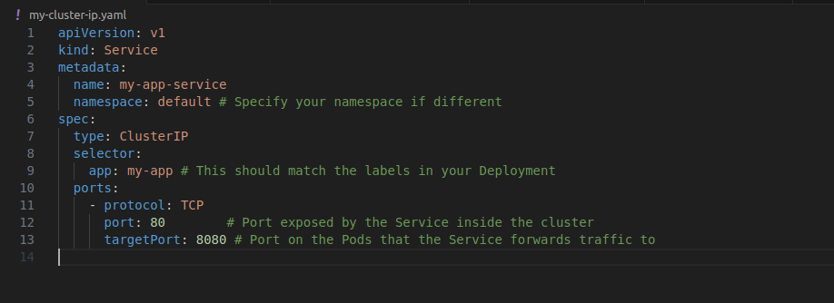
---
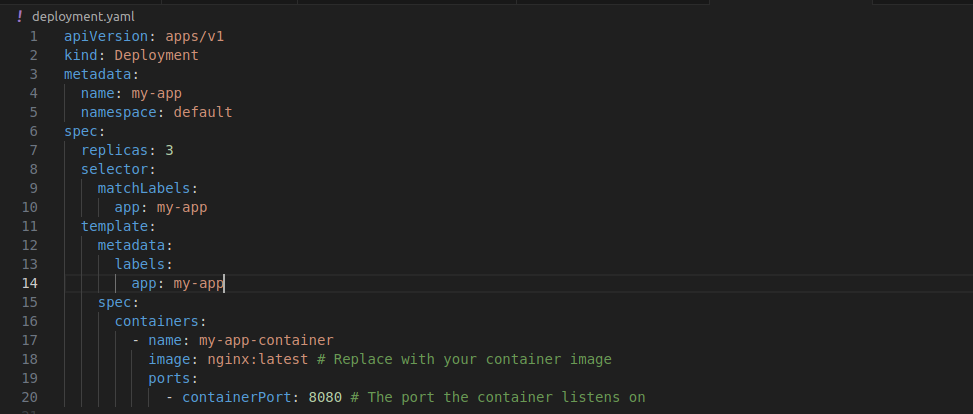
---
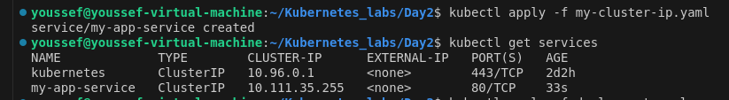
---
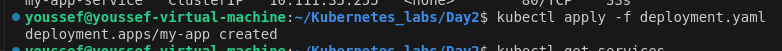
## 8- Set up a NodePort Service: Create a NodePort service that exposes a deployment named backend on port 30001 of each node. Verify that the service is accessible externally via the node’s IP and port 30001.

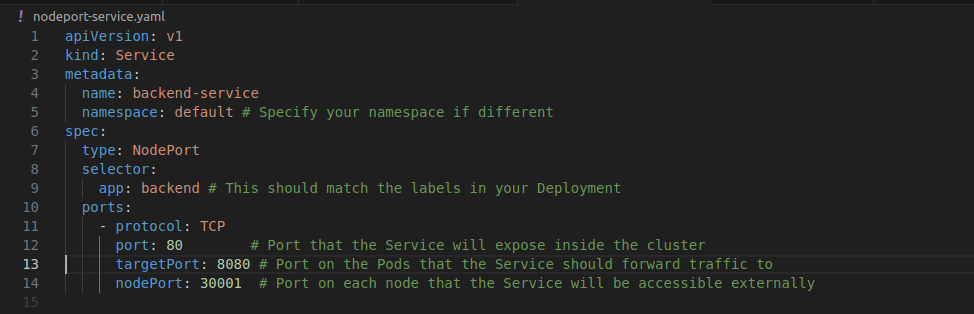
---
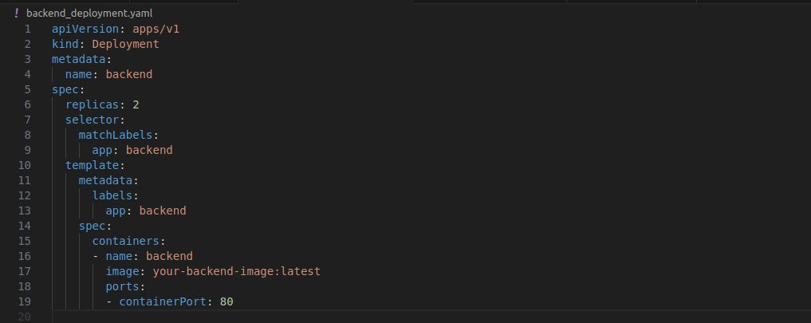
---
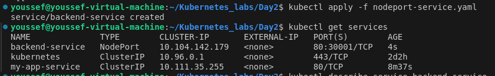
---
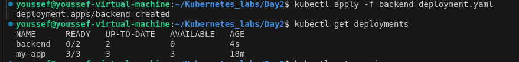

## 9- Test Service with Selectors: Create a ClusterIP service named web-service with the selector app: 0ld-web. Deploy two sets of Pods, one with the label app: old-web and another with the label app: api. Verify that only the web Pods receive traffic.

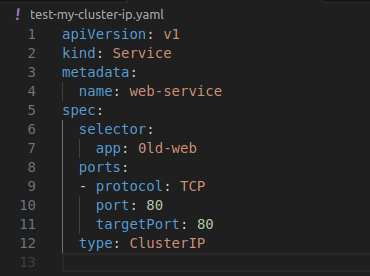
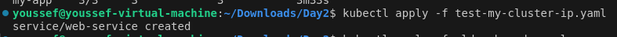
---
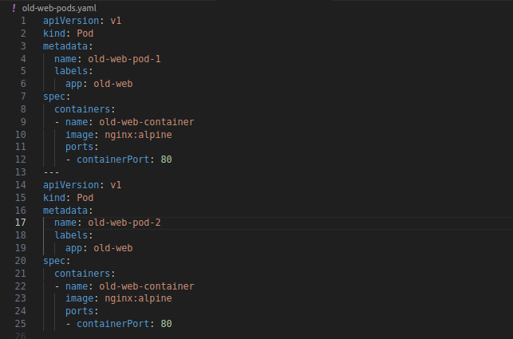
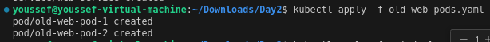
---
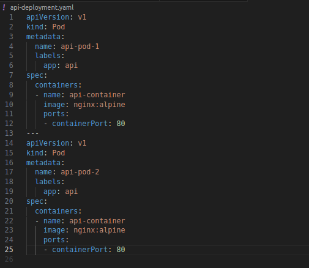
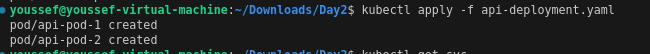
---
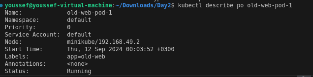
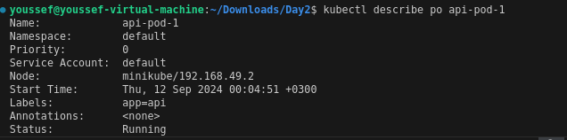

## 10- Change Service Selector: Update an existing service to change its selector from app: old-web to app: new-web. Verify that the traffic is now routed only to Pods with the new label.

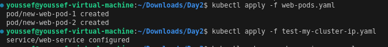
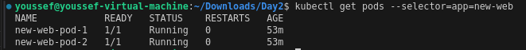

## 11- Configure a Service for Multiple Ports: Define a service that exposes multiple ports (e.g., 80 for HTTP and 443 for HTTPS) on a deployment named multi-port-app "get the front in app from your own choice". Verify both ports are accessible within the cluster.

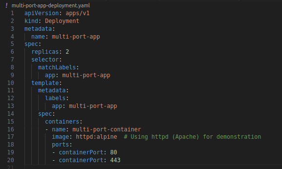