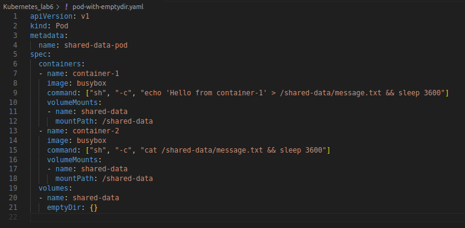
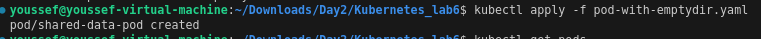
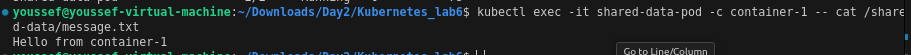

# Kubernetes_Day2_lab6

## 1- What is a volume in Kubernetes, and how does it differ from a container's storage?

### What is a Volume in Kubernetes?

- **Persistent Storage**: A volume in Kubernetes represents persistent storage that can be used to store data beyond the life of an individual container. Kubernetes volumes are designed to provide durable storage that survives container restarts and failures.

  ### How Kubernetes Volumes Differ from Container Storage

- **Persistence**:
  - **Container Storage**: Typically ephemeral, meaning that data stored in a container's filesystem is lost when the container is stopped or removed. This storage is temporary and not intended to survive container restarts or terminations.
  - **Kubernetes Volumes**: Designed to persist data beyond the lifecycle of individual containers. Volumes provide durable storage that remains available even if containers or Pods are restarted or rescheduled.

- **Accessibility**:
  - **Container Storage**: Accessible only to the specific container in which it is created. Data stored in a container is isolated and cannot be shared with other containers unless explicitly configured.
  - **Kubernetes Volumes**: Can be shared among multiple containers within the same Pod or across different Pods, depending on the volume type. This allows for collaborative access and shared storage across containers.

- **Management**:
  - **Container Storage**: Managed internally by the container's filesystem, which is part of the container image and writable layer. Containers handle their own storage without external management.
  - **Kubernetes Volumes**: Managed by Kubernetes, which supports various types of volumes and integrates with different storage backends. Kubernetes abstracts the underlying storage mechanisms and provides consistent management through volume resources.

- **Use Cases**:
  - **Container Storage**: Ideal for temporary files, caching, or data that does not need to persist beyond the container's lifecycle, such as logs or transient data.
  - **Kubernetes Volumes**: Suitable for scenarios requiring persistent data storage, such as databases, application state, configuration files, and data that needs to be retained across container restarts or shared between multiple containers.

## 2- What are the different types of volumes available in Kubernetes? Describe at least three types and their use cases.

- **Volume Types**: Kubernetes supports various types of volumes, including but not limited to:
  - **`emptyDir`**: A temporary directory that is created when a Pod is assigned to a Node and deleted when the Pod is removed.
  - **`hostPath`**: Maps a file or directory from the host node's filesystem into the Pod.
  - **`persistentVolumeClaim`**: Uses a PersistentVolumeClaim (PVC) to request storage from a PersistentVolume (PV), which is managed by Kubernetes.
  - **`configMap`**: Provides configuration data to containers.
  - **`secret`**: Stores sensitive information, such as passwords or SSH keys.
  - **`nfs`**: Connects to an NFS (Network File System) server.

## 3- How do PersistentVolumes (PVs) and PersistentVolumeClaims (PVCs) work together in Kubernetes? Explain their relationship and purpose.

**PersistentVolumes (PVs)**

### Definition: A PersistentVolume (PV) is a storage resource in a Kubernetes cluster that represents physical storage provided by a variety of backends (e.g., local disks, networked storage, cloud-based storage).

**PersistentVolumeClaims (PVCs)**

### Definition: A PersistentVolumeClaim (PVC) is a request for storage by a user or application. It specifies the desired storage capacity, access modes, and optionally a StorageClass.

## 4- Create a Pod with an emptyDir volume: Write a YAML definition for a Pod that uses an emptyDir volume to share data between two containers within the Pod. Deploy the Pod and verify that the data is shared.

`kubectl exec -it shared-data-pod -c container-1 -- cat /shared-data/message.txt`

## 5- Deploy a PersistentVolume (PV) and PersistentVolumeClaim (PVC): Create a YAML file to define a PersistentVolume of 5Gi with ReadWriteOnce access mode. Then, create a PersistentVolumeClaim requesting 2Gi of storage from this PV. Deploy both resources and verify the PVC is bound to the PV.

## 6- Create a Pod that uses a PVC: Write a YAML definition for a Pod that uses the PVC created in Exercise 3. Mount the PVC to a specific path inside the container and test that the storage is accessible.

## 7- Dynamic Provisioning of Persistent Volumes: Create a StorageClass that uses a dynamic provisioner (e.g., AWS EBS, GCE Persistent Disk, or NFS). Deploy a PVC that requests storage dynamically using this StorageClass. Verify that the storage is dynamically provisioned.

## 8- Use a configMap as a Volume: Create a ConfigMap with some configuration data. Write a Pod YAML definition that mounts this ConfigMap as a volume and verify the data is correctly mounted and accessible inside the container.

## 9- Create a Pod with a secret as a Volume: Define a Kubernetes Secret containing sensitive data. Create a Pod that mounts this secret as a volume and verify the data is correctly mounted and accessible inside the container in a secure way.

## 10- Set up a Pod with a gitRepo volume: Write a YAML definition for a Pod that uses a gitRepo volume to clone a Git repository into the container. Verify that the repository's contents are available inside the container.

## 11- Resize a Persistent Volume Claim (PVC): Create a PVC and bind it to a Pod. After deployment, resize the PVC to request more storage (assuming the underlying storage provider supports resizing). Verify that the PVC has been resized successfully.

## 12- Use subPath for mounting volumes: Create a Pod with a single volume and use the subPath feature to mount different subdirectories of that volume to different paths within a container. Verify that each path in the container corresponds to the correct subdirectory on the volume.
