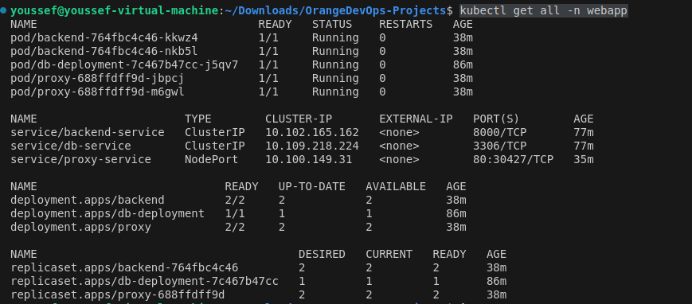
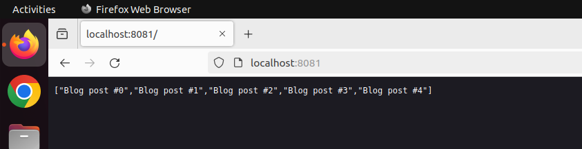

# Kubernetes Project Overview

Use this command to configure your shell to use the Docker daemon inside Minikube: `eval $(minikube docker-env)`
`kubectl get all -n webapp` to get all Deployments and Services within the namespace Called `webapp`

## First then We Have To build Our Images 
Starting With mysql image 
`docker build --no-cache -t mysql-image:latest /home/youssef/Downloads/OrangeDevOps/Docker_Project/mysql`


```bash
youssef@youssef-virtual-machine:~/Downloads/OrangeDevOps$ docker build --no-cache -t mysql-image:latest /home/youssef/Downloads/OrangeDevOps/Docker_Project/mysql
[+] Building 69.0s (5/5) FINISHED                                       docker:default
 => [internal] load build definition from Dockerfile                              0.0s
 => => transferring dockerfile: 328B                                              0.0s
 => [internal] load metadata for docker.io/library/mysql:8.0                      2.9s
 => [internal] load .dockerignore                                                 0.0s
 => => transferring context: 2B                                                   0.0s
 => [1/1] FROM docker.io/library/mysql:8.0@sha256:ccb8f749bb5e59f9f8f03bf7282c7  66.0s
 => => resolve docker.io/library/mysql:8.0@sha256:ccb8f749bb5e59f9f8f03bf7282c7e  0.0s
 => => sha256:b6c54a7f9fe815e299b650e2a42aad4f236740b6af3353893d8214 881B / 881B  1.2s
 => => sha256:ccb8f749bb5e59f9f8f03bf7282c7ef27a93a1814a24f0a8a9 2.60kB / 2.60kB  0.0s
 => => sha256:eba3c26198b76ce92acfa6308130ab3224ee9fff583c514 49.25MB / 49.25MB  38.2s
 => => sha256:972686f20d79b40117d39ca73b5b034a013cc865e57f33 983.00kB / 983.00kB  1.8s
 => => sha256:6b143fc1f4eab6fc9d20f383cd108c680170ff22678c5cd285 3.04kB / 3.04kB  0.0s
 => => sha256:f5da8fc4b539c8ff9005b316b41b09d99b6ef6cdf55b5abbfc 6.75kB / 6.75kB  0.0s
 => => sha256:48f5f58971f7de31c996b9d164627887ad94bfb12897700798 6.73MB / 6.73MB  7.2s
 => => sha256:1c3daf5de485432cea017d47fb499c82e5f61883b9beb5aad9 2.60kB / 2.60kB  3.5s
 => => sha256:eba13b8088fe1252f16f0722d9e2d3a04cd938138cd748e38e5f2d 335B / 335B  4.6s
 => => sha256:514ee5d23bc92938bf617f59570e6436c2138daf8fce417 49.18MB / 49.18MB  53.3s
 => => sha256:e91f47674d2509d1cf19c5b24b75579133d375fe358b7d1fb40a4f 316B / 316B  7.7s
 => => sha256:077dbde9e2f694950fbdc9cb268ae8a034d464c0373156a 60.93MB / 60.93MB  53.8s
 => => sha256:466b47b075c45f6750c0457257324f02b71de861329b12935 5.33kB / 5.33kB  39.1s
 => => extracting sha256:eba3c26198b76ce92acfa6308130ab3224ee9fff583c51487a8caa0  5.0s
 => => sha256:d145be117b98dbf2dabf0e7199ac541ba7493e346cb909e2ee225 121B / 121B  39.5s
 => => extracting sha256:b6c54a7f9fe815e299b650e2a42aad4f236740b6af3353893d8214f  0.0s
 => => extracting sha256:972686f20d79b40117d39ca73b5b034a013cc865e57f330367ba015  0.0s
 => => extracting sha256:48f5f58971f7de31c996b9d164627887ad94bfb12897700798a4420  0.4s
 => => extracting sha256:1c3daf5de485432cea017d47fb499c82e5f61883b9beb5aad9eb8b4  0.0s
 => => extracting sha256:eba13b8088fe1252f16f0722d9e2d3a04cd938138cd748e38e5f2d7  0.0s
 => => extracting sha256:514ee5d23bc92938bf617f59570e6436c2138daf8fce4171c3d32ff  2.4s
 => => extracting sha256:e91f47674d2509d1cf19c5b24b75579133d375fe358b7d1fb40a4fb  0.0s
 => => extracting sha256:077dbde9e2f694950fbdc9cb268ae8a034d464c0373156a34eae02a  9.9s
 => => extracting sha256:466b47b075c45f6750c0457257324f02b71de861329b12935ecceb2  0.0s
 => => extracting sha256:d145be117b98dbf2dabf0e7199ac541ba7493e346cb909e2ee225f9  0.0s
 => exporting to image                                                            0.0s
 => => exporting layers                                                           0.0s
 => => writing image sha256:5802cd2ff311660dd0d738d488d3176bc7d8b6e922d722895b76  0.0s
 => => naming to docker.io/library/mysql-image:latest                             0.0s

```
Build backend Image 
`docker build --no-cache -t project_backend:latest /home/youssef/Downloads/OrangeDevOps/Docker_Project/backend/`

**output**
```bash
docker build --no-cache -t project_backend:latest /home/youssef/Downloads/OrangeDevOps/Docker_Project/backend/
[+] Building 4.4s (15/15) FINISHED                                                                                                          docker:default
 => [internal] load build definition from Dockerfile                                                                                                  0.0s
 => => transferring dockerfile: 429B                                                                                                                  0.0s
 => [internal] load metadata for docker.io/library/debian:bullseye-slim                                                                               0.7s
 => [internal] load metadata for docker.io/library/golang:1.18                                                                                        0.7s
 => [internal] load .dockerignore                                                                                                                     0.0s
 => => transferring context: 2B                                                                                                                       0.0s
 => [builder 1/6] FROM docker.io/library/golang:1.18@sha256:50c889275d26f816b5314fc99f55425fa76b18fcaf16af255f5d57f09e1f48da                          0.0s
 => [stage-1 1/3] FROM docker.io/library/debian:bullseye-slim@sha256:00558f781b91e90469812bad32002f311ab26ef241b4a1996f6600680ec82f5c                 0.0s
 => [internal] load build context                                                                                                                     0.0s
 => => transferring context: 111B                                                                                                                     0.0s
 => CACHED [builder 2/6] WORKDIR /app                                                                                                                 0.0s
 => CACHED [stage-1 2/3] WORKDIR /app                                                                                                                 0.0s
 => [builder 3/6] COPY go.mod go.sum ./                                                                                                               0.0s
 => [builder 4/6] RUN go mod download                                                                                                                 1.6s
 => [builder 5/6] COPY . .                                                                                                                            0.0s
 => [builder 6/6] RUN go build -o main .                                                                                                              1.9s
 => [stage-1 3/3] COPY --from=builder /app/main .                                                                                                     0.1s
 => exporting to image                                                                                                                                0.1s
 => => exporting layers                                                                                                                               0.1s
 => => writing image sha256:e90e5e2005532261f90db83636ca227e3e85d395e109f9aa76c4a60795a1aad1                                                          0.0s
 => => naming to docker.io/library/project_backend:latest                 
```
 Build Proxy image 
 `docker build --no-cache -t project_proxy:latest /home/youssef/Downloads/OrangeDevOps/Docker_Project/proxy/`

 **output**
 ```bash
 docker build --no-cache -t project_proxy:latest /home/youssef/Downloads/OrangeDevOps/Docker_Proje
ct/proxy/
[+] Building 98.1s (8/8) FINISHED                                                                                                           docker:default
 => [internal] load build definition from Dockerfile                                                                                                  0.0s
 => => transferring dockerfile: 120B                                                                                                                  0.0s
 => [internal] load metadata for docker.io/library/nginx:alpine                                                                                       8.4s
 => [internal] load .dockerignore                                                                                                                     0.0s
 => => transferring context: 2B                                                                                                                       0.0s
 => [1/3] FROM docker.io/library/nginx:alpine@sha256:a5127daff3d6f4606be3100a252419bfa84fd6ee5cd74d0feaca1a5068f97dcf                                89.4s
 => => resolve docker.io/library/nginx:alpine@sha256:a5127daff3d6f4606be3100a252419bfa84fd6ee5cd74d0feaca1a5068f97dcf                                 0.0s
 => => sha256:c7b4f26a7d93f4f1f276c51adb03ef0df54a82de89f254a9aec5c18bf0e45ee9 11.21kB / 11.21kB                                                      0.0s
 => => sha256:43c4264eed91be63b206e17d93e75256a6097070ce643c5e8f0379998b44f170 3.62MB / 3.62MB                                                       77.8s
 => => sha256:a5127daff3d6f4606be3100a252419bfa84fd6ee5cd74d0feaca1a5068f97dcf 9.07kB / 9.07kB                                                        0.0s
 => => sha256:074604130336e3c431b7c6b5b551b5a6ae5b67db13b3d223c6db638f85c7ff56 2.50kB / 2.50kB                                                        0.0s
 => => sha256:5b19511a843df5d68c62b357426dd4e99e48fbeb9c085260de375065b969561f 1.75MB / 1.75MB                                                       27.3s
 => => sha256:652d69a25e853e561388e4ea6f55072df1747066277ef8310aff10d601150385 629B / 629B                                                            6.7s
 => => sha256:51676974aef5e1f3c046f2d40fa8e10d03a4c37e962e00f46bcfb5af242e81ad 956B / 956B                                                           11.3s
 => => sha256:bb16f69e8876d046e20b50c0873ac84b46e7b60926bbcc72a32765ad981cc732 393B / 393B                                                           32.7s
 => => sha256:6fb07faa0055e50ddac110c0d0b6286235e9bd9c0d4de00f0dcb5860dd5833a6 1.21kB / 1.21kB                                                       33.4s
 => => sha256:c298c5a0cd21956f1dec93f16c6968b7b009b43f22add9e78d18273bb91661f5 1.40kB / 1.40kB                                                       33.9s
 => => sha256:0c02f601d0eed2923ae2087212c9c0753846732b22db5f2088ec0daf62387e12 13.19MB / 13.19MB                                                     88.7s
 => => extracting sha256:43c4264eed91be63b206e17d93e75256a6097070ce643c5e8f0379998b44f170                                                             0.2s
 => => extracting sha256:5b19511a843df5d68c62b357426dd4e99e48fbeb9c085260de375065b969561f                                                             0.1s
 => => extracting sha256:652d69a25e853e561388e4ea6f55072df1747066277ef8310aff10d601150385                                                             0.0s
 => => extracting sha256:51676974aef5e1f3c046f2d40fa8e10d03a4c37e962e00f46bcfb5af242e81ad                                                             0.0s
 => => extracting sha256:bb16f69e8876d046e20b50c0873ac84b46e7b60926bbcc72a32765ad981cc732                                                             0.0s
 => => extracting sha256:6fb07faa0055e50ddac110c0d0b6286235e9bd9c0d4de00f0dcb5860dd5833a6                                                             0.0s
 => => extracting sha256:c298c5a0cd21956f1dec93f16c6968b7b009b43f22add9e78d18273bb91661f5                                                             0.0s
 => => extracting sha256:0c02f601d0eed2923ae2087212c9c0753846732b22db5f2088ec0daf62387e12                                                             0.5s
 => [internal] load build context                                                                                                                     0.0s
 => => transferring context: 6.61kB                                                                                                                   0.0s
 => [2/3] COPY nginx.conf /etc/nginx/nginx.conf                                                                                                       0.2s
 => [3/3] COPY ssl/ /etc/nginx/ssl/                                                                                                                   0.0s
 => exporting to image                                                                                                                                0.0s
 => => exporting layers                                                                                                                               0.0s
 => => writing image sha256:effd99d50c378350ddc9e9af0ced0d6a735fe10d96bf7d251286a4b41ad74ff0                                                          0.0s
 => => naming to docker.io/library/project_proxy:latest           
 ```
**Run These Commands to create namespace Deployments and Services**
`kubectl apply -f namespace.yaml`
`kubectl apply -f backend-deployment.yaml -n webapp`
`kubectl apply -f backend-service.yaml -n webapp`
`kubectl apply -f db-deployment.yaml -n webapp`
`kubectl apply -f db-pv-pvc.yaml -n webapp`
`kubectl apply -f db-secret.yaml -n webapp`
`kubectl apply -f db-service.yaml -n webapp`
`kubectl apply -f proxy-deployment.yaml -n webapp`
`kubectl apply -f proxy-service.yaml -n webapp`
```bash
namespace/webapp created
deployment.apps/backend created
service/backend-service created
deployment.apps/db-deployment created
persistentvolume/db-pv unchanged
persistentvolumeclaim/db-pvc created
secret/db-credentials created
service/db-service created
deployment.apps/proxy created
service/proxy-service created
```
 `kubectl get all -n webapp` to get all Deployments and Services within the namespace Called  `webapp`
 
 ## Then Go to the browser and type **localhost**
  
