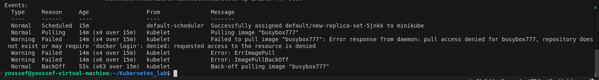
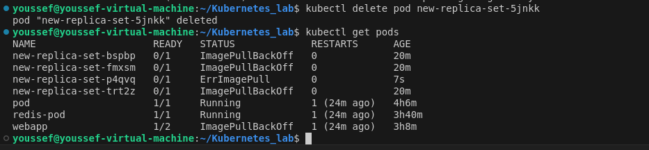

# Kubernetes_lab

## 1-Create a ReplicaSet using the below yaml

apiVersion: apps/v1
kind: ReplicaSet
metadata:
  name: new-replica-set
  namespace: default
spec:
  replicas: 4
  selector:
    matchLabels:
      name: busybox-pod
  template:
    metadata:
      labels:
        name: busybox-pod
    spec:
      containers:
      - command:
        - sh
        - -c
        - echo Hello Kubernetes! && sleep 3600
        image: busybox777
        imagePullPolicy: Always
        name: busybox-container
        
--------------------
## 2-How many PODs are DESIRED in the new-replica-set?

----------------------
## 3-What is the image used to create the pods in the new-replica-set?

---------------------
## 4-How many PODs are READY in the new-replica-set?

---------------------
## 5-Why do you think the PODs are not ready?

These is the current tunning pods 

`kubectl describe pod new-replica-set-5jnkk`
to describe on of the not ready pods

------------------------
## 6-Delete any one of the 4 PODs. 
How many pods now

---------------------
## 7-Why are there still 4 PODs, even after you deleted one?

 The ReplicaSet's self-healing mechanism automatically creates a new pod to maintain the desired number of replicas, so you might still see the same total number of pods. This ensures the application remains available and operates with the intended number of replicas.

-----------------
## 8-Create a ReplicaSet using the below yaml

There is an issue with the file, so try to fix it.

apiVersion: v1
kind: ReplicaSet
metadata:
  name: replicaset-1
spec:
  replicas: 2
  selector:
    matchLabels:
      tier: frontend
  template:
    metadata:
      labels:
        tier: frontend
    spec:
      containers:
      - name: nginx
        image: nginx

