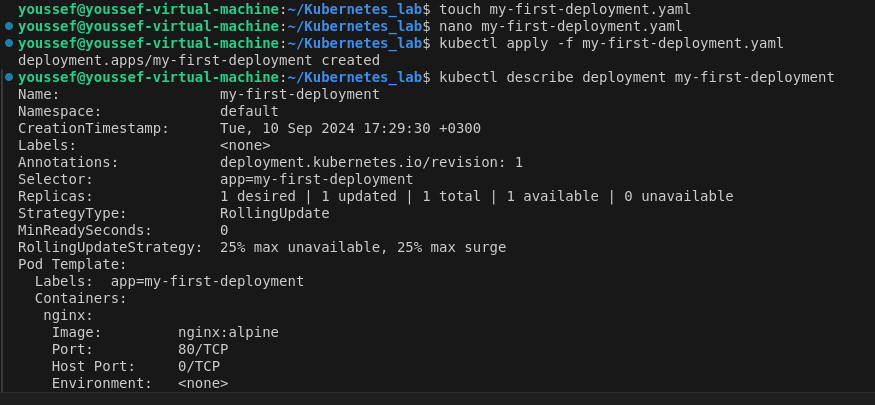
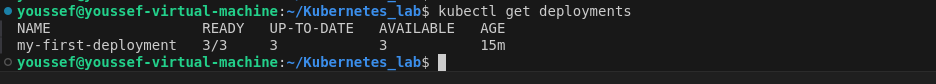
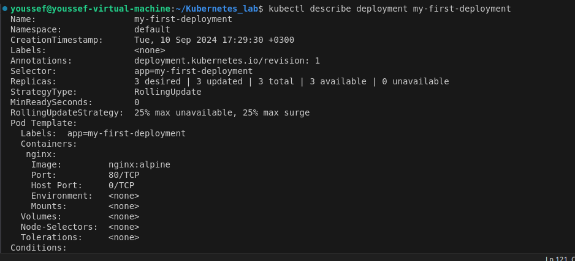
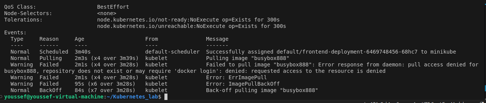
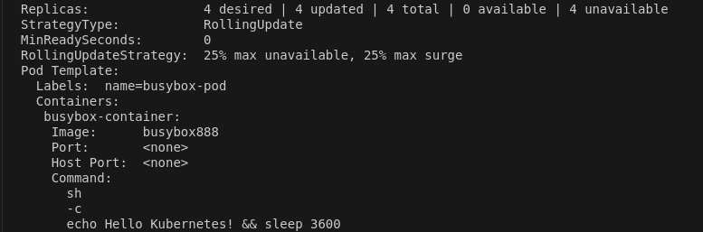

# Kubernetes_lab


## 1-Create a ReplicaSet using the below yaml

```yaml
apiVersion: apps/v1
kind: ReplicaSet
metadata:
  name: new-replica-set
  namespace: default
spec:
  replicas: 4
  selector:
    matchLabels:
      name: busybox-pod
  template:
    metadata:
      labels:
        name: busybox-pod
    spec:
      containers:
      - command:
        - sh
        - -c
        - echo Hello Kubernetes! && sleep 3600
        image: busybox777
        imagePullPolicy: Always
        name: busybox-container
```        

--------------------
## 2-How many PODs are DESIRED in the new-replica-set?


----------------------
## 3-What is the image used to create the pods in the new-replica-set?


---------------------
## 4-How many PODs are READY in the new-replica-set?


---------------------
## 5-Why do you think the PODs are not ready?

These is the current tunning pods 


`kubectl describe pod new-replica-set-5jnkk`
to describe on of the not ready pods


------------------------
## 6-Delete any one of the 4 PODs. 
How many pods now


---------------------
## 7-Why are there still 4 PODs, even after you deleted one?

 The ReplicaSet's self-healing mechanism automatically creates a new pod to maintain the desired number of replicas, so you might still see the same total number of pods. This ensures the application remains available and operates with the intended number of replicas.

-----------------
## 8-Create a ReplicaSet using the below yaml

There is an issue with the file, so try to fix it.
```yaml
apiVersion: v1
kind: ReplicaSet
metadata:
  name: replicaset-1
spec:
  replicas: 2
  selector:
    matchLabels:
      tier: frontend
  template:
    metadata:
      labels:
        tier: frontend
    spec:
      containers:
      - name: nginx
        image: nginx
```

# Deployment

## 1-Create a deployment called my-first-deployment of image nginx:alpine in the default namespace.
### Check to make sure the deployment is healthy.
```yaml
apiVersion: apps/v1
kind: Deployment
metadata:
  name: my-first-deployment
spec:
  replicas: 1
  selector:
    matchLabels:
      app: my-first-deployment
  template:
    metadata:
      labels:
        app: my-first-deployment
    spec:
      containers:
      - name: nginx
        image: nginx:alpine
        ports:
        - containerPort: 80
```


----------------
## 2-Scale my-first-deployment up to run 3 replicas.

### Check to make sure all 3 replicas are ready.
`kubectl get deployments`

### Another Detailed 
`kubectl describe deployment my-first-deployment`

----------------
## 3-Scale my-first-deployment down to run 2 replicas.
`kubectl scale deployment --replicas=2 my-first-deployment`

---------------
## 4-Change the image my-first-deployment runs from nginx:alpine to httpd:alpine .
`kubectl set image deployment/my-first-deployment nginx=httpd:alpine`

--------------------------
## 5-Delete the deployment my-first-deployment
`kubectl delete deployment my-first-deployment`

----------------------------
## 6-Create deployment from the below yaml


```yaml
apiVersion: apps/v1
kind: Deployment
metadata:
  name: frontend-deployment
  namespace: default
spec:
  replicas: 4
  selector:
    matchLabels:
      name: busybox-pod
  strategy:
    rollingUpdate:
      maxSurge: 25%
      maxUnavailable: 25%
    type: RollingUpdate
  template:
    metadata:
      labels:
        name: busybox-pod
    spec:
      containers:
      - command:
        - sh
        - -c
        - echo Hello Kubernetes! && sleep 3600
        image: busybox888
        imagePullPolicy: Always
        name: busybox-container
```        

### We need to address the issue so we have to show pods `kubectl get pods` and this is the output

### Then use `kubectl describe po frontend-deployment-6469748456-68hc7`to show the description of the pod and what can cause error and this is the output

### edit the image name 

-------------
## 7-How many ReplicaSets exist on the system now?
`kubectl get rs`

------------------------------
## 8-How many PODs exist on the system now?
` kubectl get po`

-----------------
## 9-Out of all the existing PODs, how many are ready?

### Based on the last output the 4 PODS are running


-------------------
## 10-What is the image used to create the pods in the new deployment?
`kubectl describe deployment frontend-deployment`

---------------------
## 11-Why do you think the deployment is not ready?

### The Reason is there is not image with that name (busybox888)

---------------------

# Namespace
## What is a namespace in Kubernetes, and why is it used?

### What is a Namespace?
#### Logical Partitioning:

##### Namespaces allow you to create multiple virtual clusters within a single physical Kubernetes cluster. Each namespace acts as a separate environment where you can deploy and manage resources independently.

#### Resource Isolation:

##### Resources like pods, services, and deployments are isolated within a namespace. This means that two resources with the same name can exist in different namespaces without conflicting with each other.

Scoped Access:

    Namespaces enable fine-grained access control. You can apply Role-Based Access Control (RBAC) policies to manage which users or service accounts have access to resources within a specific namespace.
---------------------
- How do you create a new namespace in Kubernetes using the kubectl command?
---------------------
- How can you list all namespaces in a Kubernetes cluster?
---------------------
- What is the default namespace in Kubernetes? What happens if you do not specify a namespace when deploying a resource?
---------------------
- How do you delete a namespace in Kubernetes? What happens to the resources within it?
---------------------
- How can you switch between namespaces while using the kubectl command?
---------------------
- How do you create a Kubernetes deployment in a specific namespace?
---------------------
- Can two different namespaces have resources with the same name? Explain your answer.
---------------------
- How can you check the resource quotas and limits for a specific namespace?
---------------------
- How do you configure a kubectl context to always use a specific namespace by default?
---------------------
- Create a YAML file to define a new namespace called dev-environment. Deploy it using kubectl.
---------------------
- Write a command to deploy a pod named test-pod running the nginx image into a namespace called testing.
---------------------
- List all the pods running in a namespace called production.